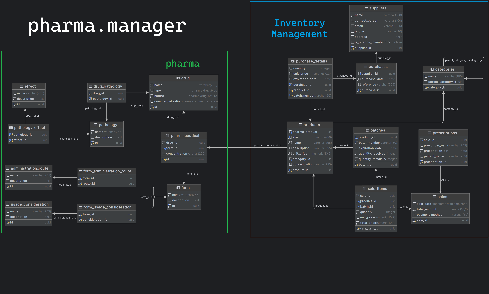

<h1 align="center">
   
   <div align="center">Pharmacy Management System</div>
</h1>

<p align="center">
  <a href="https://github.com/Yrrrrrf/pharmacy-management">
    
  </a>
  <a href="./LICENSE">
    
  </a>
  <a>
    
  </a>
  <!--
  <a href="https://github.com/Yrrrrrf/pharmacy-management/actions">
    
  </a>
  -->
</p>

The Pharmacy Management System is a comprehensive solution designed to streamline and modernize pharmacy operations. It offers a robust platform for managing inventory, prescriptions, customer data, and sales in pharmaceutical services.

## Features

Our Pharmacy Management System offers a wide range of features to optimize pharmacy operations:

- **🗃️ Inventory Management**: Track stock levels, expiration dates, and automate reordering processes.
- **💊 Prescription Handling**: Manage and process prescriptions efficiently, including refills and interactions.
- **👥 Customer Management**: Maintain detailed customer profiles, including prescription history and allergies.
- **💰 Sales and Billing**: Process transactions, generate invoices, and manage financial records.
- **📊 Reporting and Analytics**: Generate insights on sales trends, inventory turnover, and more.
- **🔄 Real-time Updates**: Utilize PLpgSQL for instant data synchronization across the system.
- **🖥️ Cross-platform Access**: Use via web browsers or as a desktop application for flexibility.
- **🔒 Secure Authentication**: Implement role-based access control to protect sensitive medical data.
- **📱 Mobile Responsiveness**: Access key features on-the-go with a mobile-friendly interface.
- **🔍 Advanced Search**: Quickly find medications, customer records, and prescription information.
- **⚠️ Drug Interaction Checker**: Alert pharmacists to potential drug interactions for patient safety.

## 🛠️ Technology Stack

- **Backend**:
    - [FastAPI](https://fastapi.tiangolo.com/) for high-performance API development
    - [PostgreSQL](https://www.postgresql.org/) for robust and scalable data storage
- **Frontend**:
    - [SvelteKit](https://kit.svelte.dev/) for efficient and reactive web development
    - [DaisyUI](https://daisyui.com/) for responsive and attractive UI components
- **Desktop Application**:
    - [Tauri](https://tauri.app/) for cross-platform desktop development
- **DevOps**:
    - [Docker](https://www.docker.com/) for containerization and easy deployment

## 🚦 Getting Started

### Prerequisites

- [Python](https://www.python.org/) (3.9 or higher)
- [Node.js](https://nodejs.org/) (14.x or higher)
- [PostgreSQL](https://www.postgresql.org/) (13 or higher)
- [Docker](https://www.docker.com/) (optional, for containerized setup)

### Installation (Local Setup)

1. Clone the repository:
   ```bash
   git clone https://github.com/Yrrrrrf/pharmacy-management.git
   cd pharmacy-management
   ```

2. Set up the backend:
   ```bash
   cd backend
   python -m venv venv
   source venv/bin/activate  # On Windows use `venv\Scripts\activate`
   pip install -r requirements.txt
   ```

3. Set up the frontend:
   ```bash
   cd frontend
   npm install
   ```

4. Configure the database:
   - Create a PostgreSQL database for the project
   - Update the database connection details in `backend/config.py`

5. Start the development servers:
   ```bash
   # In the backend directory
   uvicorn main:app --reload

   # In the frontend directory
   npm run dev
   ```

### Docker Setup

For a containerized setup, use Docker Compose:

```bash
docker-compose up -d  # Start the services in detached mode
```

This will start the backend, frontend, and database services.

## 📊 Database Schema

Our database schema is designed for efficient pharmacy data management:



The schema includes tables for medications, prescriptions, customers, inventory, sales, and more, ensuring comprehensive data management for pharmacy operations.

## 📚 API Documentation

API documentation is available at `http://localhost:8000/docs` when running the development server. It provides detailed information about available endpoints, request/response formats, and authentication requirements.

## 🖥️ Desktop Application

To run the desktop application:

```bash
cd frontend
npm run tauri dev
```

This will start the Tauri development server and launch the desktop application.

## 🧪 Testing

Run backend tests:
```bash
cd backend
pytest
```

Run frontend tests:
```bash
cd frontend
npm run test
```

## 📄 License

This project is licensed under the MIT License - see the [LICENSE](LICENSE) file for details.

## 🤝 Contributing

Contributions are welcome! Please feel free to submit a Pull Request.

## 📞 Support

If you encounter any problems or have any questions, please open an issue on the GitHub repository.
